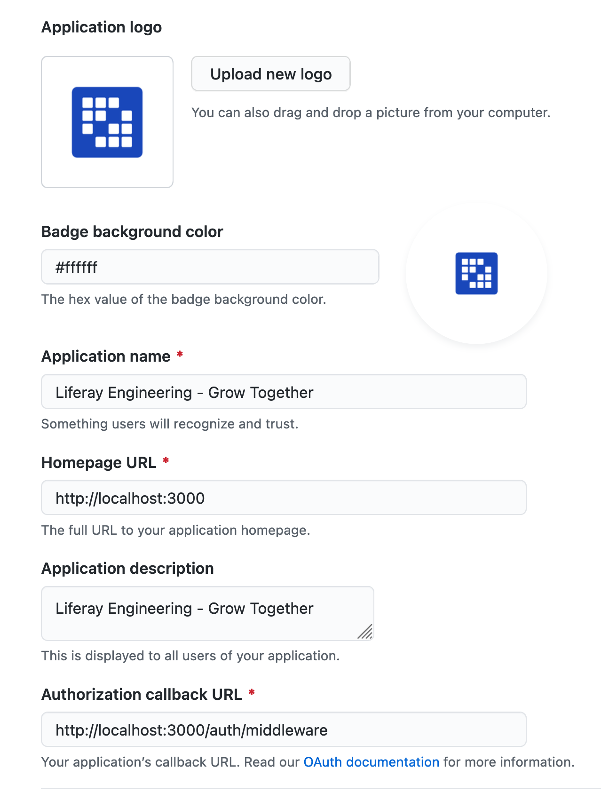

## :bulb: Installation 

This projects uses *[Yarn Workspaces](https://classic.yarnpkg.com/en/docs/workspaces/)* that is a new way to set up your package architecture.

So, yarn is **required** to install and run scripts.

1. Install the packages using **yarn** or **yarn install**
2. Frontend Configuration
    1. Create a copy of .env.example in packages/frontend/.env.example to .env in this same frontend folder. and changes some environments if you need.
3. Backend Configuration
    1. Create a copy of .env.example in *packages/backend/.env.example* to .env in this same backend folder. and changes some environments if you need.
    2. Create a copy of ormconfig *ormconfig.example.ts* and put in the main folder (the same level from packages) with the name *ormconfig.ts*
    3. Replace the connection with name **development** with your database credentials, like host, user and password. *note: you must create a database first.*
    4. After setup everything, you can use: **yarn dev:server** in the main folder to run the backend.
    5. If everything work as expected, you will see this message

    ```
    debug: TypeORM Environment: development {"timestamp":"2021-03-02T13:17:01.780Z"}
    debug: Starting Liferay Grow Server {"timestamp":"2021-03-02T13:17:03.049Z"}
    debug: App listening on the port 3333 {"timestamp":"2021-03-02T13:17:03.056Z"}
    ```

## :octocat: Github Oauth 

To use Github OAuth, you must have a [Github OAuth Application](https://github.com/settings/developers)

Follow the steps below

* OAuth Apps -> New OAuth App

  

* You can use the same configuration from image above, to run local you must use this **Homepage URL** and **Authorization callback URL** the same from image.
* After creates the application, github will generate a Client ID
* Create a Client Secret (you will see a button named Generate a new client secret)
* With Client ID and Client Secret ID in "hands" you must do the following steps.
* Backend Step
    * Go to **packages/backend** and if you don't have .env file, create one from .env.example.
    * Replace **GITHUB_CLIENT_ID** from Client ID generated from Github.
    * Replace **GITHUB_CLIENT_SECRET** from Client Secret generated from Github.
* Frontend Step
    * Go to **packages/frontend** and if you don't have .env file, create one from .env.example
    * Replace **NEXT_PUBLIC_GITHUB_CLIENT_ID** from Client ID generated from Github. 
